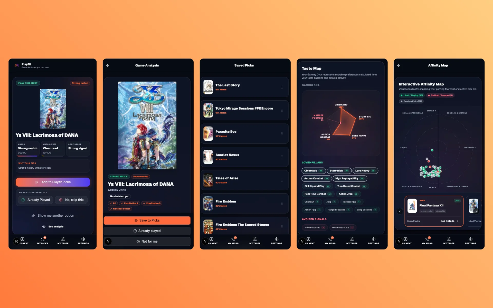

# Playfit

[](https://github.com/carloseav15/playfit/actions/workflows/ci.yml)



Playfit is an open source product and portfolio project for answering one specific question with
maximum precision: **what should I play next?**

It combines a large game catalog, platform access, ratings, onboarding signals, saved picks, and
taste analysis into practical recommendations for what to start, resume, save, or skip. A
session-free `/search` page also lets anyone browse and filter the full catalog by platform or
genre without creating an account.

This started from a personal frustration: picking up popular, hyped games and having them
mostly miss. Playfit exists to answer "what should I play next" from actual taste signals —
what you loved, what you dropped, and why — instead of from what's popular.

Live demo: [playfit-gold.vercel.app](https://playfit-gold.vercel.app)

## Why Review This Repo

- Product-grade recommendation UX with inspectable confidence, match, risk, and taste signals.
- A Supabase-backed data model with RLS, RPC boundaries, catalog cleanup migrations, and shared cache.
- A TypeScript monorepo that separates Next.js UI/API code from reusable domain logic.
- Real production deployment on Vercel backed by Supabase Postgres.
- Automated quality gates covering typecheck, lint, unit tests, build, audit, and migration validation.
- Manual verification workflows for browser e2e, backups, and cover integrity checks when credentials are available.

## Stack

- Next.js 16 App Router, React 19, TypeScript strict mode, Tailwind CSS v4
- Supabase Auth and Postgres in the `games_library` schema
- `@playfit/core` workspace package for domain logic, schema validation, seed loading, and profile persistence
- Biome for linting and Vitest/Playwright for automated checks

Next is pinned to `16.3.0-canary.34` intentionally because this repo tracks the App Router behavior
needed by the product. Dependency health is checked with `npm audit --audit-level=moderate`.

## Commands

```bash
npm install
npm run dev
npm run typecheck
npm run lint
npm test
npm run build
npm run check
npm run quality
npm run test:coverage -w apps/web

# Optional: full source coverage, including presentational React components
npm run test:coverage:full -w apps/web
npm run check:ci
npm audit --audit-level=moderate
npm run validate:migrations
npm run test:e2e
npm run check:covers
```

Use Node 22 (`.nvmrc`) for local development and CI parity.

## Prerequisites

- **Node.js 22** (`.nvmrc`)
- **Docker Desktop** — required for local Supabase
- **Supabase CLI** — `npm install -g supabase` or `brew install supabase/tap/supabase`
- **RAWG API key** — optional; only needed for scraping/enrichment scripts

Environment variables are documented in `.env.example`. `NEXT_PUBLIC_*` values are safe for the
browser; `SUPABASE_SERVICE_KEY`, `SENTRY_AUTH_TOKEN`, and other server-only secrets must remain
outside source control. For local render profiling, use `NEXT_PUBLIC_PROFILE_RENDERS=1`; it is
disabled automatically in production.

## Getting Started

```bash
# 1. Install dependencies
npm install

# 2. Start Supabase locally
supabase start

# 3. Copy environment variables
cp .env.example .env

# 4. Start the dev server
npm run dev
```

Only reset a disposable local database. `supabase db reset --local` rebuilds the local schema from
migrations and removes existing local data.

> Migrations create the schema but do **not** seed the full catalog.
> After a fresh local reset, seed catalog data:
> ```bash
> bash scripts/seed-catalog.sh
> ```
> See `docs/SCRIPTS.md` for details on seed options (local dump, staging pull, RAWG scrape).

## Architecture

- `apps/web` contains the Next.js app, route handlers, UI, and Playwright e2e tests.
- `packages/core` contains shared domain logic, Zod schemas, Supabase seed loading, and browser profile persistence.
- Prefer focused core entrypoints:
  - `@playfit/core/domain` for recommendations and onboarding logic
  - `@playfit/core/types` for shared types
  - `@playfit/core/store` for browser profile persistence
  - `@playfit/core/data` for catalog/tag seed helpers used inside this monorepo
  - `@playfit/core/supabase` for the browser Supabase client

The root `@playfit/core` entrypoint remains for compatibility, but new imports should use the
focused entrypoints to avoid pulling browser/database infrastructure into pure domain code.
`@playfit/core` is a private workspace package, so focused subpath exports are treated as
intentional internal API for Playfit apps and scripts, not as a stable third-party public package.
Do not remove exported helpers such as tag normalization, seed loading, or default state constants
unless the corresponding subpath contract is retired or replaced in the monorepo.

## Supabase

Local schema lives in `supabase/`. The migration creates `games`, `platforms`, and `profiles`, plus
grants, indexes, and RLS policies.

```bash
supabase start
supabase db reset --local
```

The migration does not seed the full catalog. Import catalog data separately before using a fresh DB
as the main app backend.

Profile API behavior:

- Authenticated users are resolved through Supabase `auth.getUser(jwt)`.
- Anonymous mode uses a browser `deviceId` and persists through `/api/profile` via SECURITY DEFINER
  Postgres functions.
- `deviceId` is a convenience identifier for local/private use, not a strong security boundary.
- The service role key is reserved for scripts, CI, migrations, and Supabase Edge Functions. It is
  not required as normal Vercel runtime configuration.

## Data Quality

`npm run check:covers` validates the live Supabase catalog against `apps/web/public/covers/games`.
It fails on missing local cover files or unsupported local cover paths, and reports duplicate catalog
title groups for manual review.

## API Endpoints

| Method | Path | Description | Auth |
|---|---|---|---|
| GET | `/api/health` | Health check (DB connection + game count) | None |
| GET | `/api/games?q=&platform=&genre=&page=&pageSize=` | Search / browse / filter game catalog | None |
| GET | `/api/games/:gameId` | Game detail (resolves redirects) | None |
| POST | `/api/games/batch` | Batch lookup (max 500 game IDs) | None |
| GET | `/api/profile?device_id=` | Read user profile | Cookie / Bearer / deviceId |
| POST | `/api/profile` | Save user profile | Cookie / Bearer / deviceId |
| DELETE | `/api/profile?device_id=` | Reset user profile | Cookie / Bearer / deviceId |
| PATCH | `/api/profile/games/:gameId` | Update game state (status, rating, etc.) | Cookie / Bearer / deviceId |
| DELETE | `/api/profile/games/:gameId` | Delete game state | Cookie / Bearer / deviceId |
| POST | `/api/auth/mark-returning` | Mark an authenticated session as returning (skips the marketing landing on next visit) | Bearer |
| POST | `/api/recommendations/today` | Today's recommendation (session-scoped, cached scoring) | Cookie / Bearer / deviceId |
| POST | `/api/recommendations/similar` | Similar + series games for a game ID | None |
| POST | `/api/recommendations/profile` | Build adaptive profile from onboarding + states | Cookie / Bearer |

## Deployment

**Live product** — [playfit-gold.vercel.app](https://playfit-gold.vercel.app)

**Production** — GitHub `main` auto-deploys to Vercel. The production app uses a Supabase project
with the durable catalog, profiles, user game states, Auth users, RLS policies, RPC functions, and
the `migrate-profile` Edge Function.

**Staging/manual verification** — `.github/workflows/deploy-staging.yml`,
`.github/workflows/manual-verification.yml`, and backup workflows are available when the matching
secrets are configured.

### Vercel

- Framework: Next.js, linked as the `playfit` Vercel project
- Build command: `npm run build`
- Output directory: `apps/web/.next` because this is a monorepo
- Environment variables configured in Vercel dashboard (see `.env.example`)
- Production URL: `https://playfit-gold.vercel.app`
- `NEXT_PUBLIC_SITE_URL` must match the canonical public URL so Supabase OAuth callbacks return to
  production instead of any local fallback.

### Database

- Production uses Supabase cloud in `us-east-1`
- Manual backup via GitHub Actions (`.github/workflows/backup.yml`) when `SUPABASE_DB_URL` is configured
- Local backup: `bash scripts/backup-all.sh`
- Restore: `bash scripts/restore-all.sh`

## Licensing and Data

Code is MIT licensed. Third-party game metadata, cover art, trademarks, and external catalog data
remain property of their respective owners and are included only where allowed for local product
development and portfolio demonstration.

### CI Pipeline

`.github/workflows/ci.yml` runs on every push/PR to `main`:
- TypeScript check, Biome lint, Vitest unit tests, Next.js build
- `npm audit --audit-level=moderate`
- Migration validation (naming, begin/commit, idempotency)

`.github/workflows/manual-verification.yml` runs on demand:
- Playwright e2e tests against a configured Supabase environment
- Optional cover integrity check against Supabase with `SUPABASE_SERVICE_KEY`

## Known Limitations

- Duplicate catalog cleanup is tracked as a separate data-quality pass; current redirects and
  canonical IDs protect app lookups, but the catalog still has manual review queues.
- `scripts/` contains operational catalog tooling that predates the current Biome formatting rules;
  app and package source are linted/formatted through workspace gates.
- Third-party game metadata and cover art are included only where appropriate for local product
  development and portfolio demonstration.
- `playfit-gold.vercel.app` is the current production URL; a dedicated custom domain can be added
  later without changing the app architecture.

## Troubleshooting

| Symptom | Likely Cause | Fix |
|---|---|---|
| `params.gameId is undefined` | Next.js 16 canary — `params` is a Promise | `const { gameId } = await props.params` |
| `Connection refused` on port 54321 | Supabase not running | `supabase start` |
| `relation "games_library.games" does not exist` | Migrations not applied | `supabase db reset --local` |
| `npm audit` reports a transitive dependency | Dependency drift | Run `npm audit fix` first; avoid `--force` unless the proposed changes are reviewed |
| Catalog is empty | Seed data not imported | Import catalog data separately (see Getting Started) |
| Build fails with `default.js` missing | Next.js 16 parallel routes requirement | Add `default.js` to parallel route slot directories |

## Documentation

Additional documentation is available in the `docs/` directory:

- `ARCHITECTURE.md` — system architecture, data flow, component relationships
- `PLAY-MVP.md` — product brief and UX contract for the `/` MVP experience
- `SCHEMA.md` — consolidated database schema (tables, columns, relationships)
- `SCRIPTS.md` — reference for all scripts in `scripts/`
- `ROADMAP.md` — live-demo status, known limitations, and future work
- `ONBOARDING.md` — step-by-step guide for new developers
- `nextjs-16-canary.md` — breaking changes and upgrade notes for Next.js 16 canary
- `AGENTS.md` (root) — development guide, migration strategy, auth architecture, UI kit conventions
- `PLAYFIT-CONTEXT.md` — PlayfitContext API reference (state shape, methods, boot sequence)
- `API.md` — detailed request/response schemas for all API endpoints
- `RELEASE_CHECKLIST.md` — pre-merge and deployment verification checklist
- `DEPENDENCIES.md` — frontend dependency usage guide
- `PERFORMANCE.md` — measured query plans and optimization decisions
