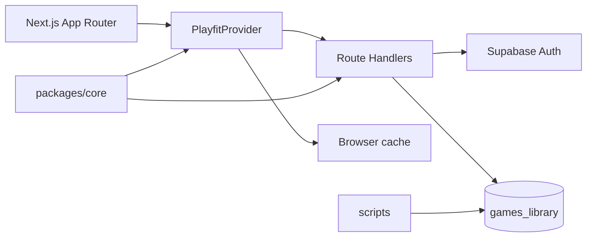
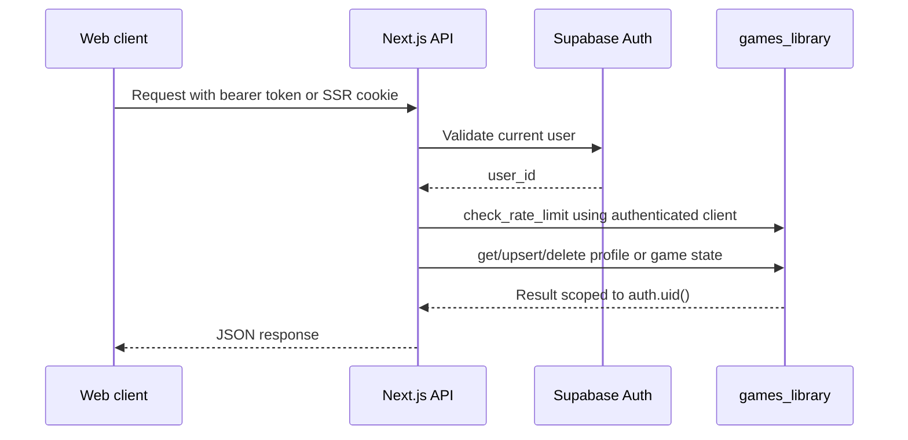

# Architecture

## Overview

`product` is an npm workspace with a Next.js web application (`apps/web`) and shared domain code (`packages/core`). Next.js Route Handlers are the runtime backend. Supabase provides authentication and the `games_library` Postgres schema; catalog-maintenance scripts run outside the web runtime.



## Runtime layout

```text
apps/web/src/
  app/
    (play)/                 # /, /game/[gameId], /picks, /taste, /settings
    api/
      games/                # catalog search, batch and detail
      profile/              # profile and per-game state persistence
      recommendations/      # today, picks, taste model, similar and dossier
      auth/callback/          # OAuth callback
    auth/reset-password/    # password reset UI
    how-it-works/ legal/ ui-kit/
  components/playfit/       # product UI and route-specific desktop/mobile shells
  lib/
    supabase/               # browser, SSR and request-authenticated clients
    game-mapper.ts          # shared catalog select and DB-to-domain mapping
    game-cache.ts           # client game cache
packages/core/src/
  domain/                   # recommendation and profile rules
  store/                    # API persistence adapter and cached auth
  schemas.ts types.ts       # shared runtime schemas and contracts
supabase/migrations/        # versioned database contract
scripts/                    # local catalog ingestion, audit and backup tools
```

## Identity and persistence

The root play experience starts or restores a Supabase session. A guest normally uses an anonymous Supabase user; linking Google with `linkIdentity` upgrades that user without changing its `user_id` or profile.

Every protected API request creates one authenticated Supabase context from either a bearer JWT or the SSR cookie session. That same client is reused for rate limiting and identity-bound RPCs. Missing or invalid sessions return `401`; a consumed limit returns `429`; an unavailable limiter returns `503`.

`deviceId` remains accepted in selected request bodies for mobile contract compatibility, but it is not a remote identity and is never used for authorization. A true local-only fallback may keep browser state when anonymous sign-in is unavailable; it does not grant remote persistence.

## Main data flows

### Profile and game state



Client mutations update React state immediately and then persist through `/api/profile` or `/api/profile/games/[gameId]`. Zod schemas in `packages/core` validate the shared payloads. Database functions also require `p_user_id = auth.uid()`; the API check is not the security boundary by itself.

### Catalog and recommendations

Catalog routes read public catalog data from Supabase. `GAME_SELECT` and `GAME_PLATFORM_SELECT` are the shared PostgREST contracts, including surrogate-key relationships such as `series_ref`, `genre_ref`, and `platform_ref`. `mapGameRowToSeedGame` produces the domain model used by web and mobile clients.

Recommendation routes combine the authenticated profile with catalog scoring RPCs. Postgres-backed cache helpers reduce repeated model/catalog work. Canonical redirects are resolved before individual game lookup.

## Security boundaries

- Runtime code uses the anon key plus the caller's session; it does not use `service_role` for user data.
- Profile RPCs bind their requested user to `auth.uid()` and have a fixed safe `search_path`.
- Public catalog tables and views expose only intended reads. User-owned tables stay RLS-scoped.
- `service_role` is reserved for controlled local/admin scripts that explicitly require it.
- Migrations are the source of truth for grants, RLS, functions, and schema changes.

## Verification

From `product/`:

```bash
npm run typecheck
npm run lint
npm test
npm run build
supabase db lint --local --schema games_library
```

Database resets are destructive to the local catalog and IGDB mirror. Back up the relevant schema before any explicitly approved reset; routine verification must not reset the database.
