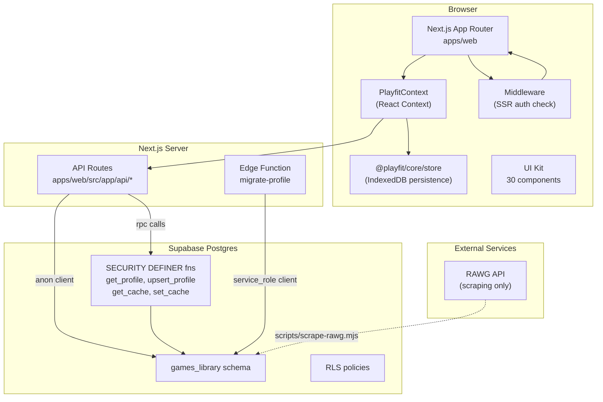
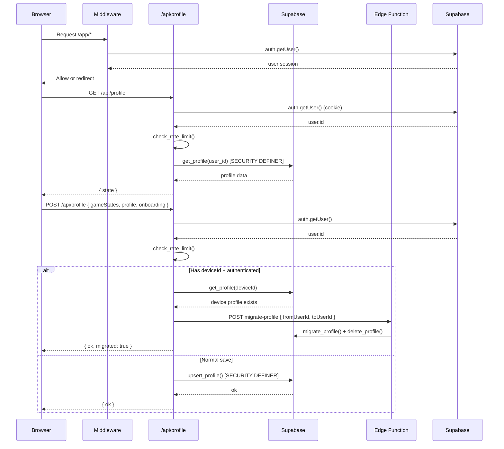
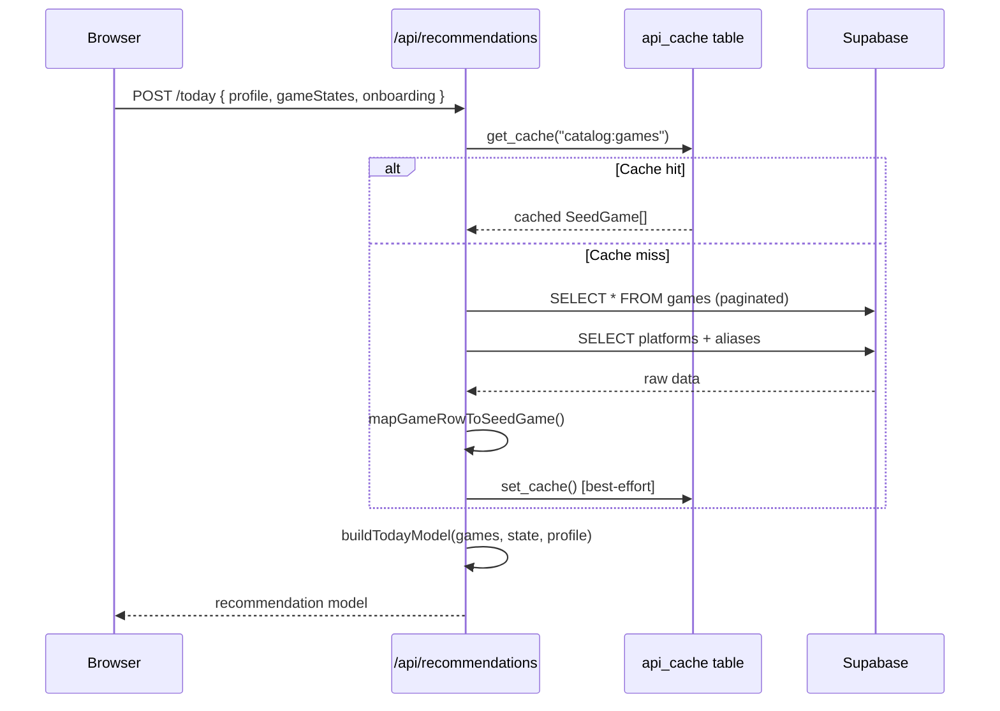

# Architecture

## High-Level Overview

Playfit is a **monorepo** with two workspaces: `apps/web` (Next.js 16 App Router) and `packages/core` (shared domain logic). The app uses **Supabase** for auth, database, and edge functions. All API routes are Next.js Route Handlers — there is no separate backend server.

## Diagram



## Data Flow

### Profile CRUD (Authenticated User)



### Recommendations



## Workspace Structure

```
apps/web/                    # Next.js 16 App Router
  src/
    app/                     # Pages + API routes
      api/                   # Route handlers (13 endpoints)
      app/                   # App shell (/app/*)
      play/                  # Play feature (/play/*)
      ui-kit/                # Living style guide
    components/
      ui/                    # 30 reusable UI components
      playfit/               # Business components (product)
      playfit-mvp/           # Business components (MVP variant)
    lib/
      supabase/              # Supabase clients (server + anon)
      game-mapper.ts         # DB row → SeedGame mapper
      game-redirects.ts      # Canonical ID resolution
      api-cache.ts           # Postgres cache helpers
      device-id.ts           # Device ID validation
  e2e/                       # Playwright tests

packages/core/               # Shared domain logic
  src/
    domain/                  # Pure functions: recommendations, onboarding, feedback
    store/                   # IndexedDB persistence layer
    data/                    # Seeds, tags
    schemas.ts               # Zod schemas
    types.ts                 # Shared TypeScript types
```

## Key Architectural Decisions

- **No `service_role` key in runtime**: Profile CRUD uses SECURITY DEFINER Postgres functions, never exposes the service key to the API route runtime. The `SUPABASE_SERVICE_KEY` is only used in CI scripts and migration tools.
- **Anonymous support via deviceId**: Browser generates a UUID v4 stored in localStorage. The API uses this as a pseudo-user ID for local-first usage without auth.
- **Postgres as cache layer**: The `api_cache` table serves as a shared cache between serverless instances (TTL 5 min). Used by `/api/recommendations/today` and `/similar`.
- **Canonical game IDs**: Game redirects (`game_redirects` table) resolve retired/duplicate IDs to canonical ones. All API game lookups go through `resolveGameRedirect()`.
- **Next.js 16 canary**: Pinned to `16.3.0-canary.34` to avoid PostCSS audit issues. See `docs/nextjs-16-canary.md` for breaking changes.

## Caching Strategy

| Cache | Location | TTL | Used by |
|---|---|---|---|
| Catalog (all games) | `api_cache` table | 300s | `/api/recommendations/today`, `/similar` |
| Static assets | Vercel CDN (Next.js) | Immutable | `/covers/games/*` |
| Auth session | HTTP cookies (Supabase SSR) | JWT expiry | Middleware, API routes |
| Profile data | Browser IndexedDB | Persistent | `@playfit/core/store` |

## Security Model

- **RLS**: `games` + `platforms` are world-readable. `profiles` + `user_game_states` are user-scoped. `rate_limits` + `audit_log` have INSERT-only policies.
- **Rate limiting**: `check_rate_limit()` RPC enforces 30 req/min per IP for `/api/profile`, 60 req/min for `/api/profile/games`.
- **Device ID validation**: UUID v4 regex check on query params for anonymous access.
- **Edge Function**: Sanitizes error messages (no key leaks), uses try/catch at top level.
