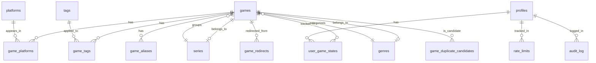

# Database Schema — `games_library`

Playfit stores catalog and profile data in the `games_library` schema. There is also a `games_library_private` schema for maintenance/audit tables not exposed via API.

## Entity-Relationship Diagram

## Tables

### `games` — Master game catalog
| Column | Type | Description |
|---|---|---|
| `game_id` | `text PK` | Unique slug/identifier (e.g. `rawg_zelda_breath_of_the_wild`) |
| `title` | `text NOT NULL` | Display title |
| `aliases` | `text[] DEFAULT '{}'` | Alternative names for search (denormalized cache of game_aliases) |
| `release_year` | `integer` | Release year |
| `release_state` | `text DEFAULT 'released'` | Check: `released`, `unreleased` |
| `source_type` | `text DEFAULT 'finder'` | Check: `catalog`, `universe`, `finder` |
| `source_ref` | `text DEFAULT ''` | External reference URL/ID (e.g. `rawg:12345`) |
| `cover_url` | `text DEFAULT ''` | Cover image path or URL |
| `tags` | `text[] DEFAULT '{}'` | Gameplay tags (denormalized cache of game_tags) |
| `notes` | `text DEFAULT ''` | Internal notes |
| `sort_date` | `date` | Sortable date for ordering |
| `genre_id` | `text FK -> genres(id)` | Normalized genre |
| `series_id` | `text FK -> series(id)` | Normalized series/franchise |
| `search_document` | `tsvector` | Stored tsvector for full-text search (title + aliases + series + genre) |
| `created_at` | `timestamptz` | Row creation timestamp |
| `updated_at` | `timestamptz` | Last update timestamp |

**Indexes:** title, source_type, release_state, release_year, tags (GIN), search_document (GIN)
**RLS:** SELECT only (anon + authenticated)

---

### `platforms` — Platform definitions
| Column | Type | Description |
|---|---|---|
| `id` | `text PK` | Platform slug (e.g. `nintendo_switch`) |
| `name` | `text NOT NULL` | Display name |
| `rawg_id` | `integer` | RAWG API platform ID |
| `family` | `text DEFAULT 'other'` | Platform family: `nintendo`, `playstation`, `xbox`, `sega`, `pc`, `apple`, `google`, `snk`, `atari`, `other` |
| `vendor` | `text DEFAULT 'Other'` | Manufacturer display name |
| `kind` | `text DEFAULT 'other'` | Form factor: `console`, `handheld`, `hybrid`, `computer`, `other` |
| `gen` | `integer DEFAULT 99` | Hardware generation (0=non-console, 2-10) |
| `created_at` | `timestamptz` | Row creation timestamp |
| `updated_at` | `timestamptz` | Last update timestamp |

**RLS:** SELECT only (anon + authenticated)

---

### `profiles` — User profiles
| Column | Type | Description |
|---|---|---|
| `id` | `uuid PK DEFAULT gen_random_uuid()` | Internal row ID |
| `user_id` | `uuid NOT NULL UNIQUE` | Auth user ID (`auth.uid()`) or device UUID |
| `game_states` | `jsonb DEFAULT '{}'` | Per-game state map (denormalized; primary source is user_game_states) |
| `profile` | `jsonb` | User profile preferences |
| `onboarding` | `jsonb` | Onboarding state |
| `created_at` | `timestamptz` | Row creation timestamp |
| `updated_at` | `timestamptz` | Last update timestamp |

**Indexes:** user_id (btree)
**RLS:** SELECT/INSERT/UPDATE where `auth.uid() = user_id`

---

### `game_platforms` — Many-to-many: games ↔ platforms
| Column | Type | Description |
|---|---|---|
| `game_id` | `text FK -> games(game_id) ON UPDATE CASCADE ON DELETE CASCADE` | Game ID |
| `platform_id` | `text FK -> platforms(id) ON DELETE CASCADE` | Platform ID |
| `created_at` | `timestamptz` | Row creation timestamp |
| `updated_at` | `timestamptz` | Last update timestamp |
| **PK** | `(game_id, platform_id)` | |

**Indexes:** game_id, platform_id

---

### `genres` — Controlled genre vocabulary
| Column | Type | Description |
|---|---|---|
| `id` | `text PK` | URL-safe slug (e.g. `role_playing_games_rpg`) |
| `name` | `text NOT NULL UNIQUE` | Display name (e.g. "Role-Playing Games (RPG)") |
| `updated_at` | `timestamptz` | Last update timestamp |

---

### `series` — Game series/franchises
| Column | Type | Description |
|---|---|---|
| `id` | `text PK` | URL-safe slug (e.g. `the_legend_of_zelda`) |
| `name` | `text NOT NULL UNIQUE` | Display name (e.g. "The Legend of Zelda") |
| `updated_at` | `timestamptz` | Last update timestamp |

---

### `tags` — Gameplay/style tags
| Column | Type | Description |
|---|---|---|
| `id` | `text PK` | URL-safe slug |
| `name` | `text NOT NULL` | Display name |
| `updated_at` | `timestamptz` | Last update timestamp |

---

### `game_tags` — Many-to-many: games ↔ tags
| Column | Type | Description |
|---|---|---|
| `game_id` | `text FK -> games(game_id) ON UPDATE CASCADE ON DELETE CASCADE` | Game ID |
| `tag_id` | `text FK -> tags(id)` | Tag ID |
| `created_at` | `timestamptz` | Row creation timestamp |
| `updated_at` | `timestamptz` | Last update timestamp |
| **PK** | `(game_id, tag_id)` | |

**Indexes:** game_id, tag_id

---

### `game_aliases` — Alternative search names
| Column | Type | Description |
|---|---|---|
| `game_id` | `text FK -> games(game_id) ON UPDATE CASCADE ON DELETE CASCADE` | Game ID |
| `alias` | `text NOT NULL` | Alternative name for search |
| `created_at` | `timestamptz` | Row creation timestamp |
| `updated_at` | `timestamptz` | Last update timestamp |
| **PK** | `(game_id, alias)` | |

**Indexes:** alias (btree), game_id (btree)

---

### `user_game_states` — Normalized per-game user state
| Column | Type | Description |
|---|---|---|
| `id` | `uuid PK DEFAULT gen_random_uuid()` | Internal row ID |
| `user_id` | `uuid FK -> profiles(user_id) ON DELETE CASCADE` | User ID |
| `game_id` | `text FK -> games(game_id) ON UPDATE CASCADE ON DELETE CASCADE` | Game ID |
| `status` | `text` | Check: `playing`, `on_hold`, `shelved`, `beaten`, `completed`, `abandoned`, `want_to_play` |
| `rating` | `numeric(2,1)` | Rating 0.0-5.0 |
| `in_backlog` | `boolean DEFAULT false` | In backlog |
| `in_wishlist` | `boolean DEFAULT false` | In wishlist |
| `in_playfit_picks` | `boolean DEFAULT false` | Saved to Playfit Picks |
| `excluded` | `boolean DEFAULT false` | Excluded from recommendations |
| `source` | `text NOT NULL` | Check: `onboarding`, `finder`, `manual` |
| `created_at` | `timestamptz` | Row creation timestamp |
| `updated_at` | `timestamptz` | Last update timestamp |
| **UNIQUE** | `(user_id, game_id)` | |

**Indexes:** user_id, game_id, (user_id, status)

---

### `rate_limits` — Rate limiting tracking
| Column | Type | Description |
|---|---|---|
| `id` | `bigint PK GENERATED ALWAYS AS IDENTITY` | Auto-incrementing ID |
| `ip_address` | `text NOT NULL` | Client IP |
| `endpoint` | `text NOT NULL` | API endpoint path |
| `requested_at` | `timestamptz DEFAULT now()` | Request timestamp |
| `user_id` | `uuid` | Optional user ID for authenticated requests |

**Indexes:** (ip_address, endpoint, requested_at), (requested_at), (user_id, endpoint, requested_at)
**RLS:** INSERT only

---

### `audit_log` — Audit trail
| Column | Type | Description |
|---|---|---|
| `id` | `bigint PK GENERATED ALWAYS AS IDENTITY` | Auto-incrementing ID |
| `user_id` | `uuid` | User who performed the action |
| `action` | `text NOT NULL` | Action name (e.g. `profile.write`, `profile.delete`) |
| `ip_address` | `text` | Client IP |
| `metadata` | `jsonb` | Optional metadata |
| `created_at` | `timestamptz DEFAULT now()` | Action timestamp |

**Indexes:** user_id, (action, created_at)
**RLS:** INSERT only

---

### `api_cache` — Shared Postgres cache
| Column | Type | Description |
|---|---|---|
| `cache_key` | `text PK` | Cache key |
| `value` | `jsonb NOT NULL` | Cached value |
| `expires_at` | `timestamptz DEFAULT now() + interval '5 min'` | Expiration timestamp |
| `created_at` | `timestamptz DEFAULT now()` | Row creation timestamp |

**Indexes:** (expires_at)

---

### `game_redirects` — Retired → canonical game ID mapping
| Column | Type | Description |
|---|---|---|
| `from_game_id` | `text PK` | Retired/non-canonical game ID |
| `to_game_id` | `text FK -> games(game_id) ON UPDATE CASCADE ON DELETE RESTRICT` | Canonical target game ID |
| `reason` | `text DEFAULT 'duplicate_merge'` | Check: `duplicate_merge`, `manual_id_change`, `source_cleanup`, `catalog_retirement` |
| `notes` | `text DEFAULT ''` | Human-readable notes |
| `created_by` | `text DEFAULT 'manual'` | Source of the redirect |
| `created_at` | `timestamptz` | Row creation timestamp |
| `updated_at` | `timestamptz` | Last update timestamp |
| **CHECK** | `from_game_id <> to_game_id` | No self-redirects |

**Indexes:** to_game_id

---

### Duplicate Management Tables

See `game_duplicate_groups`, `game_duplicate_candidates` in `supabase/migrations/20260613231214_catalog_duplicate_review_safety.sql` for the duplicate review queue schema. These tables support the catalog deduplication workflow and are not directly exposed via the API.

### Private Schema (`games_library_private`)

Contains maintenance audit tables: `game_duplicate_merge_runs`, `game_duplicate_merge_items`, `user_data_reset_runs`, `user_data_reset_backups`. These are not exposed to API consumers.

## RLS Policy Summary

| Table | anon | authenticated | service_role |
|---|---|---|---|
| games | SELECT | SELECT | ALL |
| platforms | SELECT | SELECT | ALL |
| profiles | — | SELECT/INSERT/UPDATE (own) | ALL |
| user_game_states | — | — | ALL (accessed via SECURITY DEFINER fns) |
| rate_limits | INSERT | INSERT | ALL |
| audit_log | INSERT | INSERT | ALL |
| api_cache | — | — | ALL (accessed via SECURITY DEFINER fns) |
| game_redirects | — | — | ALL |

## Key SECURITY DEFINER Functions

| Function | Purpose | Called From |
|---|---|---|
| `get_profile(p_user_id)` | Read profile + game_states | `/api/profile` GET |
| `upsert_profile(p_user_id, p_game_states, p_profile, p_onboarding)` | Create/update profile | `/api/profile` POST |
| `delete_profile(p_user_id)` | Delete profile | `/api/profile` DELETE |
| `upsert_game_state(...)` | Create/update game state | `/api/profile/games/:gameId` PATCH |
| `delete_game_state(p_user_id, p_game_id)` | Delete game state | `/api/profile/games/:gameId` DELETE |
| `migrate_profile(p_from_user_id, p_to_user_id, p_onboarding)` | Migrate device profile to auth user | Edge Function `migrate-profile` |
| `get_cache(p_key)` | Read from api_cache | `/api/recommendations/*` |
| `set_cache(p_key, p_value, p_ttl_seconds)` | Write to api_cache | `/api/recommendations/*` |
| `check_rate_limit(p_ip, p_endpoint, p_max, p_window, p_user_id)` | Rate limit check | All profile endpoints |
