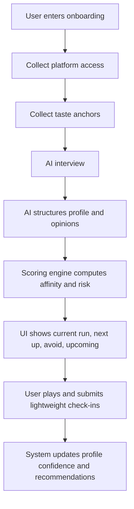

# System Flow Spec

## Goal

Describe the minimum system flow that turns a new user from zero data into a first useful recommendation.

This document is meant to connect:

- the product thesis
- the onboarding flow
- the current CSV-based prototype
- a future AI-assisted product implementation

## Product Modes

There are two system modes.

### 1. Operator Mode

Current state of the project.

Flow:

- the user gives information indirectly
- Codex structures or edits CSV data
- the web app reads those CSVs and renders outputs

### 2. User Mode

Target product state.

Flow:

- the user interacts directly with the product
- the AI structures the user's answers
- the system writes structured records
- the product renders recommendations and explanations

The product should be described as a transition from operator mode to user mode.

## Core System Objective

The system must answer four decisions:

1. What should the user continue right now?
2. What should the user start next?
3. What should the user resume later?
4. What should the user avoid for now?

## High-Level Flow

## Step-by-Step System Flow

## Step 1: Platform Access

### User Input

- selected platforms
- optional access state such as `available`, `limited`, `planned`

### AI Responsibility

- normalize user language into canonical platform IDs when needed
- resolve friendly labels to canonical records

### Structured Output

- writes to `user_platform_access.csv`

### Relevant Datasets

- [platforms.csv](/Users/carancibia/Downloads/games-library/platforms.csv)
- [user_platform_access.csv](/Users/carancibia/Downloads/games-library/user_platform_access.csv)

### Why It Exists

- recommendations need platform eligibility
- upcoming releases need `Available to you`

## Step 2: Taste Anchors

### User Input

- 3 games they loved
- 3 games they dropped or disliked
- 1 current game, optional
- 3 games they are curious about, optional

### AI Responsibility

- normalize titles
- resolve likely matches
- identify whether each title already exists in visible catalog or hidden universe

### Structured Output

- draft rows in `user_game_opinions.csv`
- optional seed rows in `recommendation_log.csv`

### Relevant Datasets

- [games_catalog.csv](/Users/carancibia/Downloads/games-library/games_catalog.csv)
- [master_game_universe.csv](/Users/carancibia/Downloads/games-library/master_game_universe.csv)
- [user_game_opinions.csv](/Users/carancibia/Downloads/games-library/user_game_opinions.csv)
- [recommendation_log.csv](/Users/carancibia/Downloads/games-library/recommendation_log.csv)

## Step 3: AI Interview

### User Input

- short natural-language answers about:
  - why they loved a game
  - why a game failed
  - what frustrates them most
  - what matters most in play
  - whether they tend to drop, pause, or watch the rest

### AI Responsibility

- infer structured preferences
- map notes to consistent tags
- identify early positive and negative patterns

### Structured Output

- rows in `user_profile.csv`
- enriched notes and tags in `user_game_opinions.csv`

### Relevant Datasets

- [user_profile.csv](/Users/carancibia/Downloads/games-library/user_profile.csv)
- [user_game_opinions.csv](/Users/carancibia/Downloads/games-library/user_game_opinions.csv)

## Step 4: Profile Confirmation

### User Input

- confirm, edit, or reject inferred profile signals

### AI Responsibility

- explain the inferred model in plain language
- apply user corrections cleanly

### Structured Output

- corrected `user_profile.csv`

### Product Rule

- explicit user correction overrides AI inference

## Step 5: Candidate Preparation

### System Input

- active catalog
- hidden universe
- user profile
- user opinions
- platform access
- open recommendations
- upcoming releases

### AI Responsibility

- optionally enrich unseen games with missing metadata
- generate predicted affinity for titles with no personal history

### Rule Engine Responsibility

- compute:
  - profile match
  - backlog priority
  - trap risk
  - watch risk
  - next up
  - best resume
  - avoid for now

### Structured Output

- runtime records, not necessarily persisted
- optional derived cache for future finder/search flows

### Relevant Code

- [src/domain/scoring.ts](/Users/carancibia/Downloads/games-library/src/domain/scoring.ts)
- [src/domain/today.ts](/Users/carancibia/Downloads/games-library/src/domain/today.ts)
- [src/domain/upcoming.ts](/Users/carancibia/Downloads/games-library/src/domain/upcoming.ts)

## Step 6: First Product Output

### UI Output

- `Current run`
- `Next up`
- `Best resume`
- `Avoid for now`
- `Upcoming`
- initial profile signals

### Requirements

- every recommendation must expose short reasons
- confidence must be visible when signal is weak

### Relevant UI Areas

- [src/ui/sections/today.ts](/Users/carancibia/Downloads/games-library/src/ui/sections/today.ts)
- [src/ui/sections/collections.ts](/Users/carancibia/Downloads/games-library/src/ui/sections/collections.ts)
- [src/ui/sections/library.ts](/Users/carancibia/Downloads/games-library/src/ui/sections/library.ts)

## Step 7: Feedback Loop

### User Input

- session check-in
- updated status
- optional friction note

### AI Responsibility

- structure free-text friction into known patterns
- suggest whether the recommendation model needs adjustment

### Structured Output

- `session_checkins.csv`
- optional updates to `user_game_opinions.csv`
- optional updates to `user_profile.csv`

### Relevant Datasets

- [session_checkins.csv](/Users/carancibia/Downloads/games-library/session_checkins.csv)
- [user_game_opinions.csv](/Users/carancibia/Downloads/games-library/user_game_opinions.csv)
- [user_profile.csv](/Users/carancibia/Downloads/games-library/user_profile.csv)

## Data Responsibility Split

## Human Truth

These fields should be treated as user truth:

- platform ownership/access
- status
- whether a game was enjoyed
- whether a game was dropped
- why it failed
- whether a recommendation felt correct

## AI Inference

These fields can be AI-assisted:

- profile signal extraction
- drop reason normalization
- predicted affinity for unseen games
- short explanation bullets
- metadata enrichment

## Rule Engine

These should remain deterministic product logic:

- unique `playing`
- separation of `current run`, `next up`, `resume`, `avoid`
- platform eligibility
- confidence thresholds
- visibility rules in the UI

## Minimum Storage Model

In the current prototype, the minimal persistent system is:

- `user_profile.csv`
- `user_platform_access.csv`
- `user_game_opinions.csv`
- `session_checkins.csv`
- `recommendation_log.csv`
- `games_catalog.csv`
- `master_game_universe.csv`
- `upcoming_releases.csv`
- `upcoming_release_platforms.csv`

In a future app, these would map naturally to tables with the same responsibilities.

## Cold-Start Exit Criteria

The system should consider a new user ready for first recommendations when it has at least:

- platform access
- 3 liked titles
- 3 disliked or dropped titles
- one completed AI interview pass

At that point the system can generate:

- initial profile
- first affinity estimates
- first avoid signals
- first next-play suggestions

## Portfolio Narrative

This flow is useful in a portfolio because it shows:

- a clear cold-start strategy
- a defined AI role
- a separation between human truth and machine inference
- a practical path from prototype operations to product automation

## Next Artifact

The next useful artifact after this spec is:

- a screen flow or wireframe document showing each onboarding and recommendation surface
